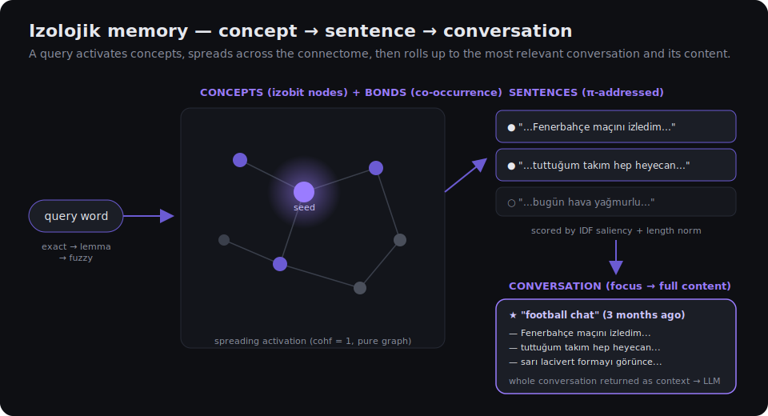
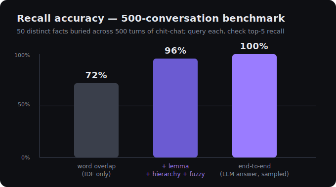

<div align="center">

# QCognitiveLayer

### An **izolojik associative-memory layer** for Large Language Models

*Dynamic cognitive memory layer for LLMs — learns as you talk.*

*Drop it into any LLM project. It remembers conversations the way a mind does —
by association, hierarchy, and recall — not by nearest-neighbour lookup.*

[](LICENSE)


</div>

---

## Two integration paths

### A — Python module (embed directly)

```python
from engine.memory import Memory

mem = Memory()

# store a conversation turn
mem.remember("My daughter's name is Alice.", ts=time.time(), season="chat-1", role="user")
mem.remember("Noted — Alice.", ts=time.time(), season="chat-1", role="assistant")
mem.save("data/checkpoints/memory.pkl")

# later, in any session
mem = Memory.load("data/checkpoints/memory.pkl")
result = mem.recall("What is my daughter's name?", hops=3, k=5)
for chunk in result["chunks"]:
    print(chunk["text"])   # → "My daughter's name is Alice."
```

`Memory` has zero runtime dependencies (Python 3.9+ stdlib).
Optional: `pip install zemberek-python` for Turkish morphological lemmatization.

---

### B — REST sidecar (drop alongside any stack)

```bash
python server.py      # listens on :8011
```

```http
POST /chat
{ "season": "user-123", "message": "What is my daughter's name?" }
→ streamed answer with recalled context already injected
```

```http
GET  /stats                         memory size
GET  /seasons                       list of chats
GET  /season?id=user-123            history + metadata
POST /settings  { "model": "ollama:llama3.1", "hops": 3, "lang": "en" }
```

The server handles recall → prompt injection → LLM streaming → background learning in one loop.
Swap the LLM by posting to `/settings`; memory is model-agnostic.

> **Playground UI** — `http://localhost:8011` opens a minimal chat interface to test recall before
> integrating. It is not the product; it is a scratchpad.

---

## What it does (and what it doesn't)

Every turn:

1. **Recall** — activates concept seeds from the query, spreads activation across the learned bond graph,
   scores by IDF saliency, focuses on the most relevant conversation, returns its content.
2. **Inject** — recalled fragments + the last 60 turns of this chat go into the LLM prompt.
3. **Learn** (background thread) — the new turn updates the graph; lemmatization + checkpoint run
   without blocking the response.

It does **not** embed text, train a model, or manage the LLM. It manages the memory.

---

## Why not just a vector database?

| | Vector-DB RAG | **QCognitiveLayer** |
|---|---|---|
| Retrieval | nearest-neighbour on embeddings | spreading activation over a learned bond graph |
| Multi-hop | ✗ | ✓ `team` → `Arsenal` via a learned co-occurrence edge |
| Reinforcement | static index | Hebbian — co-recalled concepts strengthen over time |
| Unit of recall | a chunk | sentence → *whole conversation* → its sibling sentences |
| Saliency | uniform | IDF — rare / meaningful concepts outweigh filler |
| Transparency | opaque scores | every recall traceable to a concept bridge |

---

## Conceptual foundation (izoloji)

Built on the **İdeal Hayat Paradigması** (*The Ideal Life Paradigm*) by H. Orkun Eser.
The core claim: meaning, memory, and primitive intelligence can emerge from one repeated rule over a
network of **izobits** — *matter + information + bond*.

- **izobit = concept node** — the token (matter), its frequency/saliency (information), its edges (bond).
- **bond = co-occurrence** — concepts seen together are linked; links are plastic (Hebbian).
- **öbek = sentence** — the atomic recall unit, tagged with a **π-address**
  `θ_k = 2π · frac(k/φ)` (golden angle → non-repeating canonical order).
- **recall = spreading activation** — pure graph diffusion (`cohf = 1`), no phase gating.
- **hierarchy** — sentences roll up to conversations; recall focuses the conversation, then its content.

> *The same rule, iterated at every scale → izobit → concept → sentence → conversation.*

<div align="center">

</div>

---

## Benchmark

<div align="center">

</div>

500 turns of chit-chat, 50 distinct facts buried inside. Query each fact:

- **96%** top-5 recall at the memory layer
- **100%** end-to-end (sampled) when the LLM sees the recalled context
- Cross-session verified: fact stored in chat A → recalled correctly from an empty chat B

---

## Setup

```bash
git clone https://github.com/orkuneser/QCognitiveLayer
cd QCognitiveLayer
python server.py        # no pip install required for core
```

**LLM backends** (configure in `/settings` or `data/config.json`):

| backend | setup |
|---|---|
| **Ollama** (local, no key) | `ollama serve` + `ollama pull llama3.1` |
| **Gemini** | API key from [aistudio.google.com](https://aistudio.google.com/app/apikey) → paste in settings |

---

## Repository map

```
engine/memory.py      Memory class — the full izolojik graph, recall, lemma, fuzzy, hierarchy
engine/autonomous.py  background association probe (query → wander → pending_aha)
llm/router.py         Gemini (live model list) + Ollama, both streaming
server.py             REST API + background learn loop + i18n system prompt
web/                  test playground UI (English default, Türkçe option)
docs/ARCHITECTURE.md  data structures, recall mathematics, tuning knobs
```

---

## Honest limitations

- **Semantic gaps without shared context** — if `"team"` and `"Arsenal"` were never co-mentioned,
  no bond exists. A cosine²/embedding collapse layer (roadmap) closes this.
- **Lemmatization is optional** — without Zemberek, Turkish inflections don't merge (weaker recall,
  still functional).
- **Recall is deterministic**, not a neural reranker — that is the trade-off and the point.

## Roadmap

- [ ] Embedding / cosine² collapse layer (semantic bridge for co-occurrence gaps)
- [ ] POS-weighted focus (person/place/date nodes weighted by query type)
- [ ] MCP tool wrapper (`recall` / `remember` as agent tools)
- [ ] Incremental checkpoint (avoid full pickle on very large memories)

---

## Citation

```bibtex
@software{qcognitivelayer,
  author  = {Eser, H. Orkun},
  title   = {QCognitiveLayer: an izolojik associative-memory layer for LLMs},
  year    = {2026},
  license = {MIT}
}
```

[MIT License](LICENSE) © 2026 H. Orkun Eser
